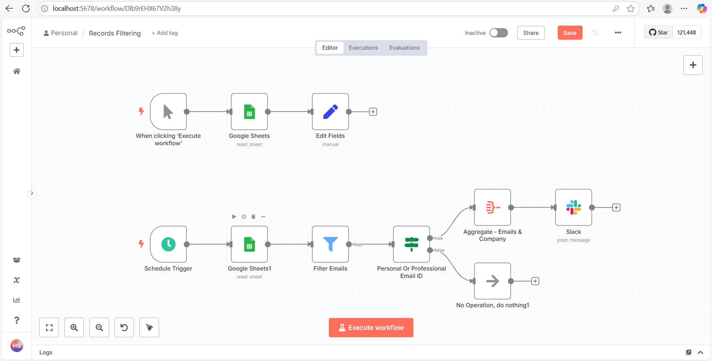
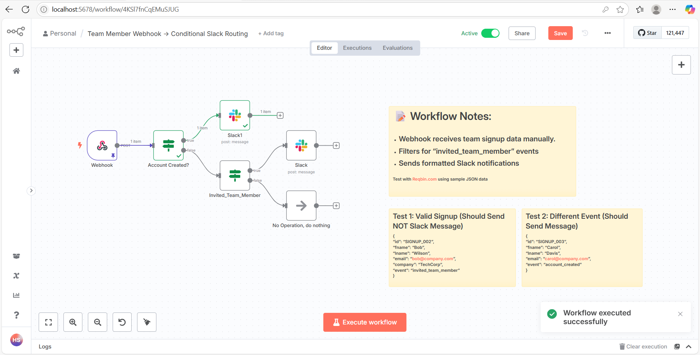
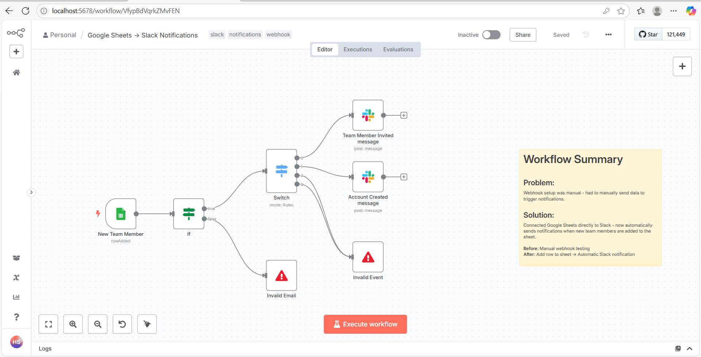

# My n8n Workflows

Collection of automation workflows built with n8n for learning.

## Workflows

**Records Filtering** - Google Sheets data processing with email filtering and Slack notifications

**Team Member Webhook** - Webhook handler for team signup events with conditional Slack routing

**Google Sheets → Slack** - Automated notifications for new team members added to sheets

**Error Handler** - Basic error handling workflow

## Setup

1. Import JSON files into your n8n instance
2. Configure Slack and Google Sheets credentials  
3. Test with "Execute Workflow" button

## Requirements

- n8n instance
- Slack bot token
- Google Sheets API access

---
*Learning project - feedback welcome!*
